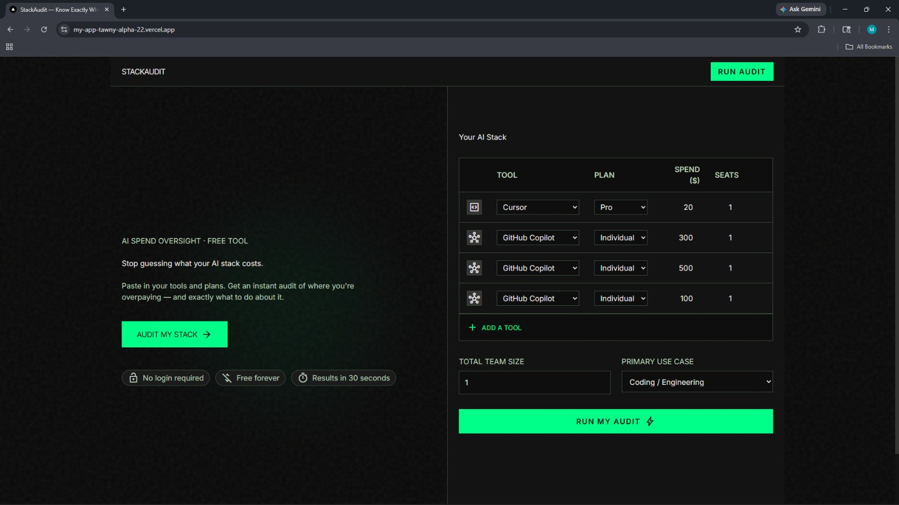
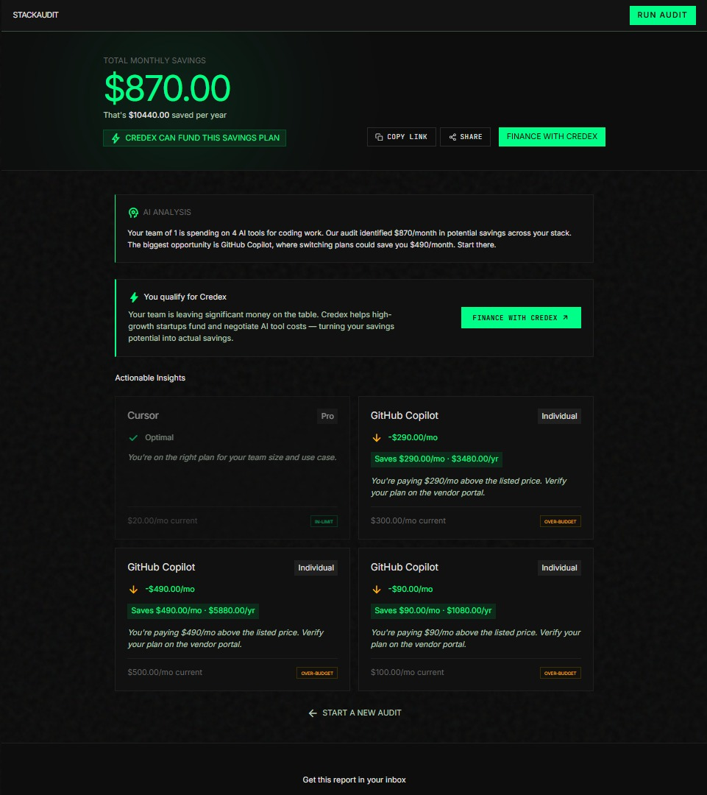

# README.md

## StackAudit — AI Spend Audit Tool

StackAudit is a free web app for startup founders and engineering
managers who want to know exactly where they're overpaying for AI
tools like Cursor, ChatGPT, Claude, and GitHub Copilot — and what
to do about it. Enter your stack, get an instant audit, share the
report with your team.

Built as Round 1 submission for Credex Web Development Internship.

**Live URL:** https://my-app-tawny-alpha-22.vercel.app

---

## Screenshots

### Landing Page — Spend Input Form


### Audit Results Page


[▶ Watch 30-second demo](https://www.loom.com/share/5948c637e9f1485aba4a4209e8cc3557)

---

## Quick Start

### Prerequisites
- Node.js 18+
- npm 9+
- Supabase account (free tier works)
- Gemini API key (free at aistudio.google.com)
- Resend account (free tier works)

### Install and Run Locally

```bash
git clone https://github.com/manthanut27/my-app
cd my-app
npm install
```

Create `.env.local` at the project root:
NEXT_PUBLIC_SUPABASE_URL=your_supabase_url
NEXT_PUBLIC_SUPABASE_ANON_KEY=your_anon_key
SUPABASE_SERVICE_ROLE_KEY=your_service_role_key
GEMINI_API_KEY=your_gemini_key
RESEND_API_KEY=your_resend_key
RESEND_FROM_EMAIL=onboarding@resend.dev
NEXT_PUBLIC_APP_URL=http://localhost:3000

Run Supabase schema (paste in Supabase SQL Editor):

```sql
CREATE TABLE audits (
  id UUID PRIMARY KEY DEFAULT gen_random_uuid(),
  created_at TIMESTAMPTZ NOT NULL DEFAULT now(),
  team_size INTEGER NOT NULL,
  use_case TEXT NOT NULL CHECK (use_case IN
    ('coding','writing','data','research','mixed')),
  tools_input JSONB NOT NULL,
  results JSONB NOT NULL,
  total_monthly_savings NUMERIC(10,2) NOT NULL,
  total_annual_savings NUMERIC(10,2) NOT NULL,
  ai_summary TEXT,
  is_optimal BOOLEAN NOT NULL DEFAULT false
);

CREATE TABLE leads (
  id UUID PRIMARY KEY DEFAULT gen_random_uuid(),
  created_at TIMESTAMPTZ NOT NULL DEFAULT now(),
  audit_id UUID NOT NULL REFERENCES audits(id) ON DELETE CASCADE,
  email TEXT NOT NULL,
  company_name TEXT,
  role TEXT,
  team_size INTEGER,
  is_high_savings BOOLEAN NOT NULL DEFAULT false,
  email_sent BOOLEAN NOT NULL DEFAULT false,
  ip_hash TEXT NOT NULL
);

ALTER TABLE audits ENABLE ROW LEVEL SECURITY;
ALTER TABLE leads ENABLE ROW LEVEL SECURITY;
CREATE POLICY "audits_public_read" ON audits FOR SELECT USING (true);
CREATE POLICY "audits_service_insert" ON audits FOR INSERT WITH CHECK (true);
CREATE POLICY "audits_service_update" ON audits FOR UPDATE USING (true);
CREATE POLICY "leads_service_only" ON leads FOR ALL USING (false);
```

Then start the dev server:

```bash
npm run dev
```

Open http://localhost:3000

### Run Tests

```bash
npm run test
```

### Deploy

```bash
npx vercel --prod
```

Set the same environment variables in Vercel dashboard under
Settings → Environment Variables.

---

## Decisions

**1. Rule-based audit engine over AI-generated recommendations**
The audit logic is pure TypeScript with no AI involved. I made this
decision because financial recommendations need to be deterministic
and auditable. A finance person reading the output should be able to
trace every savings figure back to a specific rule and a verified
price. Using AI for the logic would introduce hallucination risk on
the most trust-sensitive part of the product. AI is used only for
the summary paragraph — a non-critical, cosmetic feature with a
hardcoded fallback.

**2. Gemini over Anthropic API for AI summary**
The assignment preferred Anthropic API but allowed alternatives.
I chose Gemini because gemini-1.5-flash has a generous free tier
with no credit card required, which removes a setup barrier for
anyone trying to run this locally. The summary is 100 words — well
within Gemini Flash's quality ceiling for this task.

**3. Supabase over Firebase or Cloudflare D1**
I chose Supabase because it gives Postgres (not a NoSQL store),
built-in Row Level Security for isolating PII from public audit
data, and a dashboard that makes it easy to verify data is saving
correctly during development. The RLS policy that strips email from
public audit reads is a single SQL line — equivalent logic in
Firebase would require multiple security rules.

**4. No login required, email captured after value shown**
This was a product decision, not a technical one. Requiring login
before showing the audit would kill conversion. The assignment
specified this explicitly and it is correct — users need to see
their savings number before they trust the product enough to share
their email. Lead capture after value delivery is a standard
B2B SaaS pattern.

**5. localStorage for form persistence over server-side sessions**
Form state persists across page reloads via localStorage. I chose
this over a server session or URL params because it requires zero
backend infrastructure, works offline, and is invisible to the user.
The tradeoff is that clearing browser storage loses the form state —
acceptable for a tool used in one session.
